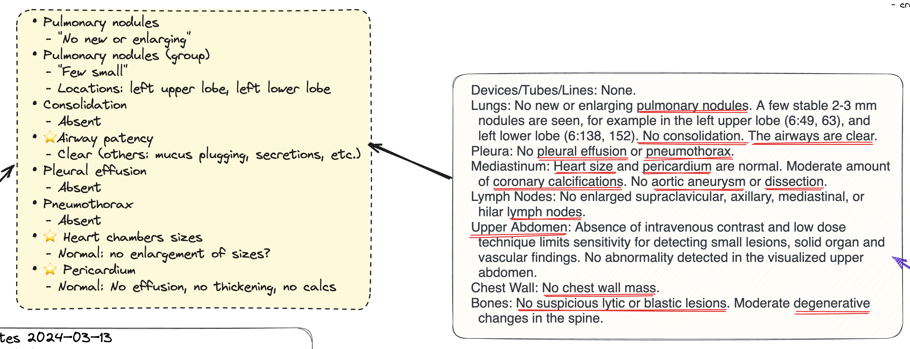

## Chest CT Findings

- Pulmonary nodules
  - "No new or enlarging"
- Pulmonary nodules (group)
  - "Few small"
  - Locations: left upper lobe, left lower lobe
- Consolidation
  - Absent
- ⭐Airway patency
  - Clear (others: mucus plugging, secretions, etc.)
- Pleural effusion
  - Absent
- Pneumothorax
  - Absent
- ⭐ Heart chambers sizes
  - Normal: no enlargement of sizes?
- ⭐ Pericardium
  - Normal: No effusion, no thickening, no calcs
